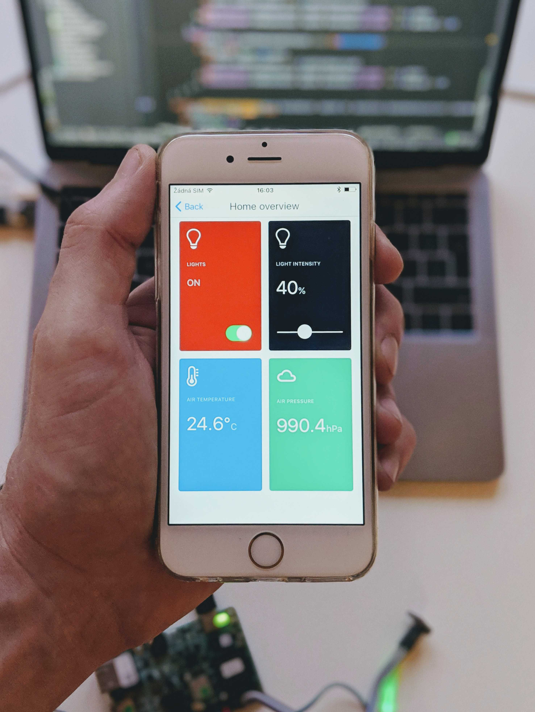

Smarthome companion app for Android Things workshop by eMan
===========================================================
Cross platform (Android, iOS) React Native app for controlling Smarthome based on Android Things platform.

Getting Started
---------------

1. Download and setup npm
2. Download and setup react-native for global use

Development
-----------

1. Clone this repository
2. Run `npm install` to fetch npm dependencies for project (or use `yarn install`)
3. Connect a device and run app
   1. Run `react-native run-android` to run app on Android device
   2. Run `react-native run-ios` to run app on iOS device

Useful Links
------------

* [Get npm](https://www.npmjs.com/get-npm)
* [React Native Getting Started](https://facebook.github.io/react-native/docs/getting-started.html)

Download app build to your device
---------------------------------

* [iOS app](https://rink.hockeyapp.net/apps/937c7f9b738d40618d14b3a7f82422f9/app_versions/2)
* [Android app](https://rink.hockeyapp.net/apps/2fbbc9c70a9b4ca29c65ed3e4d8deb04/app_versions/3)
